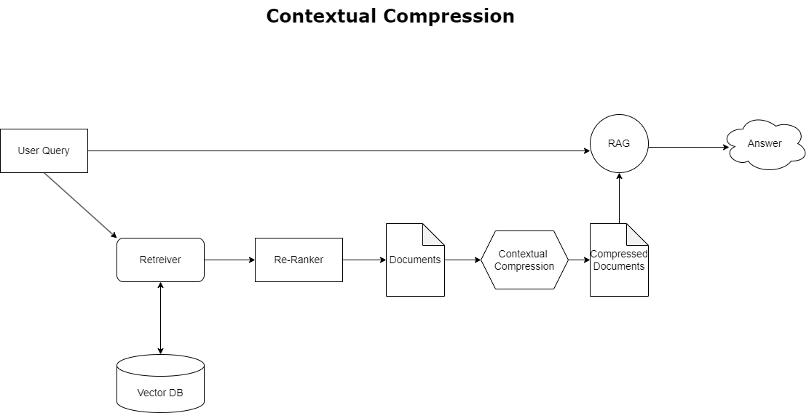

# Advanced RAG Patterns with Mixtral on SageMaker Jumpstart

Example Jupyter Notebook of [Mixtral 8x7B Instruct](https://huggingface.co/mistralai/Mixtral-8x7B-Instruct-v0.1) and [BGE Large En](https://huggingface.co/BAAI/bge-large-en) to experiment Advanced Retrieval Augmented Generation (RAG) QnA systems on a SageMaker Notebook using [LangChain](https://www.langchain.com/).

## :books: Background

[Amazon SageMaker](https://aws.amazon.com/sagemaker/) is a fully managed service for data science and machine learning (ML) workflows.
You can use Amazon SageMaker to simplify the process of building, training, and deploying ML models.

The [SageMaker example notebooks](https://sagemaker-examples.readthedocs.io/en/latest/) are Jupyter notebooks that demonstrate the usage of Amazon SageMaker.

The [Sagemaker Example Community repository](https://github.com/aws/amazon-sagemaker-examples-community) are additional notebooks, beyond those critical for showcasing key SageMaker functionality, can be shared and explored by the commmunity.

## Architecture

## Solution

In this post, we explain and demonstrate the use of Mixtral 8x7B Instruct text generation combined with  [BGE Large En](https://huggingface.co/BAAI/bge-large-en) embedding model to efficiently construct a Retrieval Augmented Generation (RAG) QnA system on a [SageMaker](https://www.googleadservices.com/pagead/aclk?sa=L&ai=DChcSEwjC_smL6eSEAxUEaEcBHZKoCSwYABAAGgJxdQ&ase=2&gclid=CjwKCAiAi6uvBhADEiwAWiyRdm9fVXFJASMNG1LKo8hiUv7jEdUGhQ51tmCA-DngfHXsGDxLTBupFxoCvOcQAvD_BwE&ohost=www.google.com&cid=CAESVuD21B3o9zHMrlIQeG15m__r93DdZcVN4-3nXJ8u-dbMgnV5nBVFDPVOeevCZP5QgBP14_Qeor3zFwnOSibAEKrO6aqVYLSUyGSmJPwkoSC1y-dk0RNh&sig=AOD64_1g7baA79iO0oQhm2pU4_You-GQgQ&q&nis=4&adurl&ved=2ahUKEwjqhL-L6eSEAxUqD1kFHbRFAUEQ0Qx6BAgHEAE) Notebook using the Parent Document Retriever tool and Contextual Compression technique. This solution can be deployed with just a few clicks using [SageMaker JumpStart](https://aws.amazon.com/sagemaker/jumpstart/), a fully-managed platform that offers state-of-the-art foundation models for various use cases such as content writing, code generation, question answering, copywriting, summarization, classification, and information retrieval. It provides a collection of pre-trained models that can be deployed quickly and easily, accelerating the development and deployment of machine learning applications. One of the key components of SageMaker Jumpstart is the Model Hub, which offers a vast catalog of pre-trained models such as the Mixtral 8x7B for a variety of tasks.

## Parent Document Retriever Workflow

## Contextual Compression Workflow

## :hammer_and_wrench: Setup

The quickest setup to run example notebooks includes:
- An [AWS account](http://docs.aws.amazon.com/sagemaker/latest/dg/gs-account.html)
- Proper [IAM User and Role](http://docs.aws.amazon.com/sagemaker/latest/dg/authentication-and-access-control.html) setup
- An [Amazon SageMaker Notebook Instance](http://docs.aws.amazon.com/sagemaker/latest/dg/gs-setup-working-env.html)

## Contributing

We welcome community contributions! Please see [CONTRIBUTING.md](CONTRIBUTING.md) for guidelines.

## Security

See [CONTRIBUTING](CONTRIBUTING.md#security-issue-notifications) for more information.

## License

This library is licensed under the MIT-0 License. See the [LICENSE](LICENSE) file.
